# SWENG 837 Course Project

## Use Case Diagram
The Use Case Diagram highlights the key actors, including traders, market data providers and clearinghouses, who interact with the system. Traders perform actions like placing orders, viewing market data and executing trades. The system interfaces with external market data providers to retrieve real-time information.

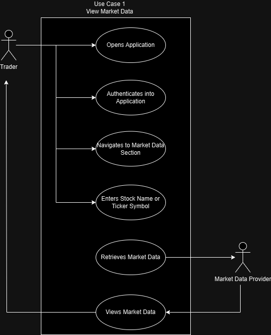

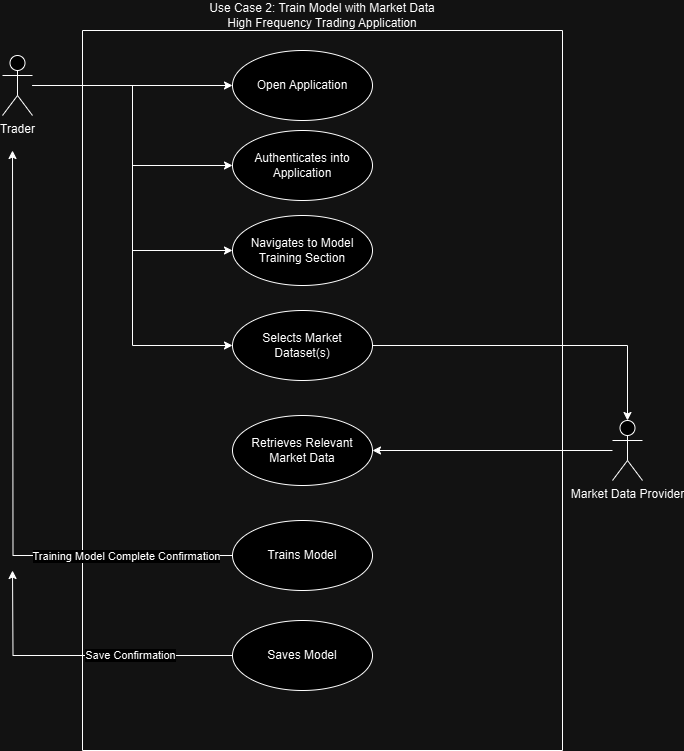

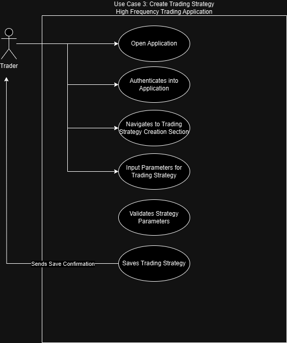

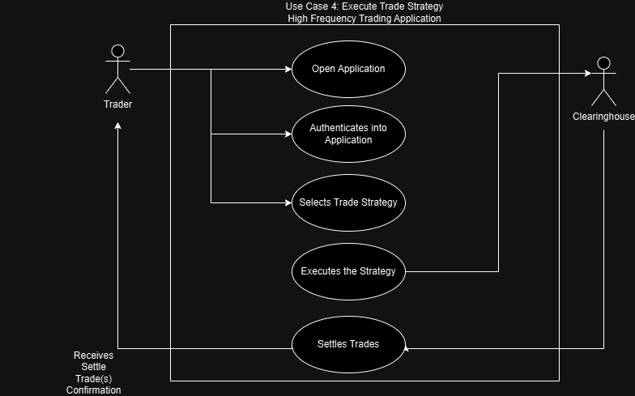

## Activity/Sequence Diagram
The Sequence Diagram illustrates the flow of activities in a typical trading scenario. It shows the interactions between a Trader and the system, such as logging in, retrieving market data, placing an order and receiving confirmation of the trade execution. 

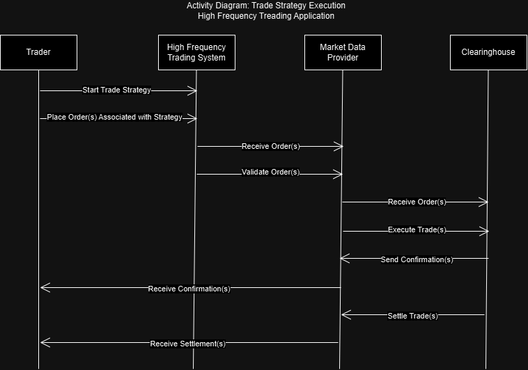

## Sequence Diagram
Activity Diagram further details the interactions between the Trader, High-Frequency Trading System, Market Data Provider and Clearinghouse, highlighting the process of order placement, validation, execution and settlement in high-frequency trading applications.

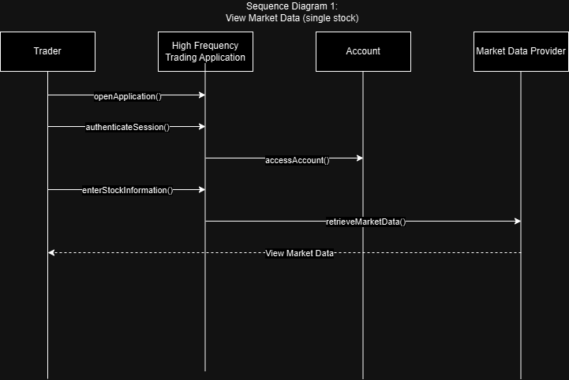

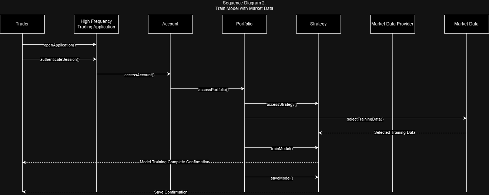

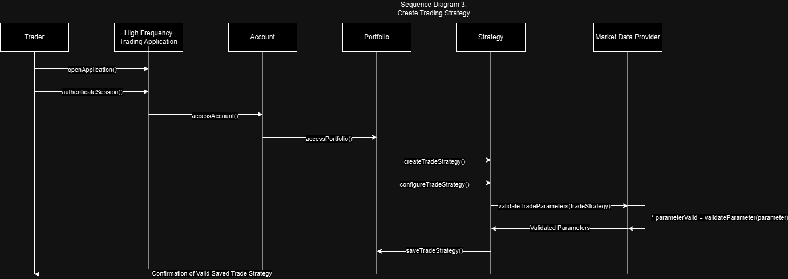

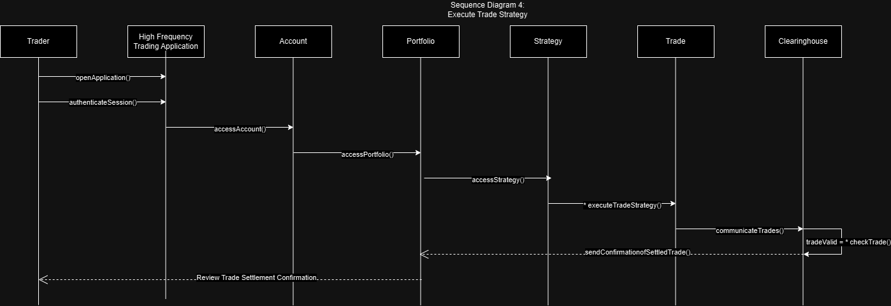

## Domain Model Diagram
The Domain Model for the High-Frequency Trading Application outlines the key entities such as Trader, Account, Portfolio, Trade, Clearinghouse, Strategy, Machine Learning Model and Market Data and their relationships. Traders manage accounts and portfolios, develop strategies and execute trades, which are settled by Clearinghouses. Strategies may be enhanced by Machine Learning Models trained on Market Data to optimize trading decisions. This model emphasizes the structured interactions and dependencies essential for efficient high-frequency trading operations.

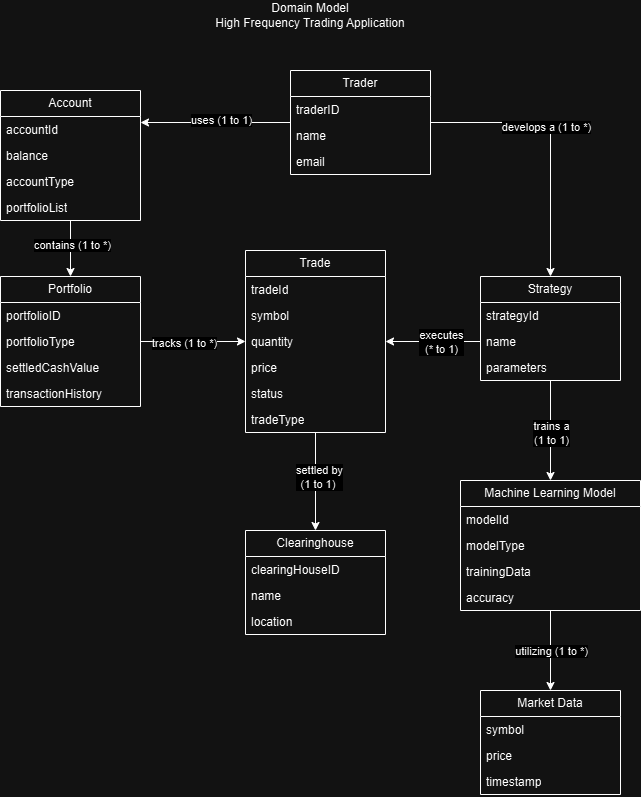

## Class Diagram
The Class Diagram details the key classes in the system, such as Trader, Order, Portfolio and MarketData. Each class contains attributes relevant to its role, like the Trader class with email and name and the Order class with order type and status. Relationships between classes, such as the association between a Trader and their Portfolio or Orders, are also depicted, reflecting the system's structure.

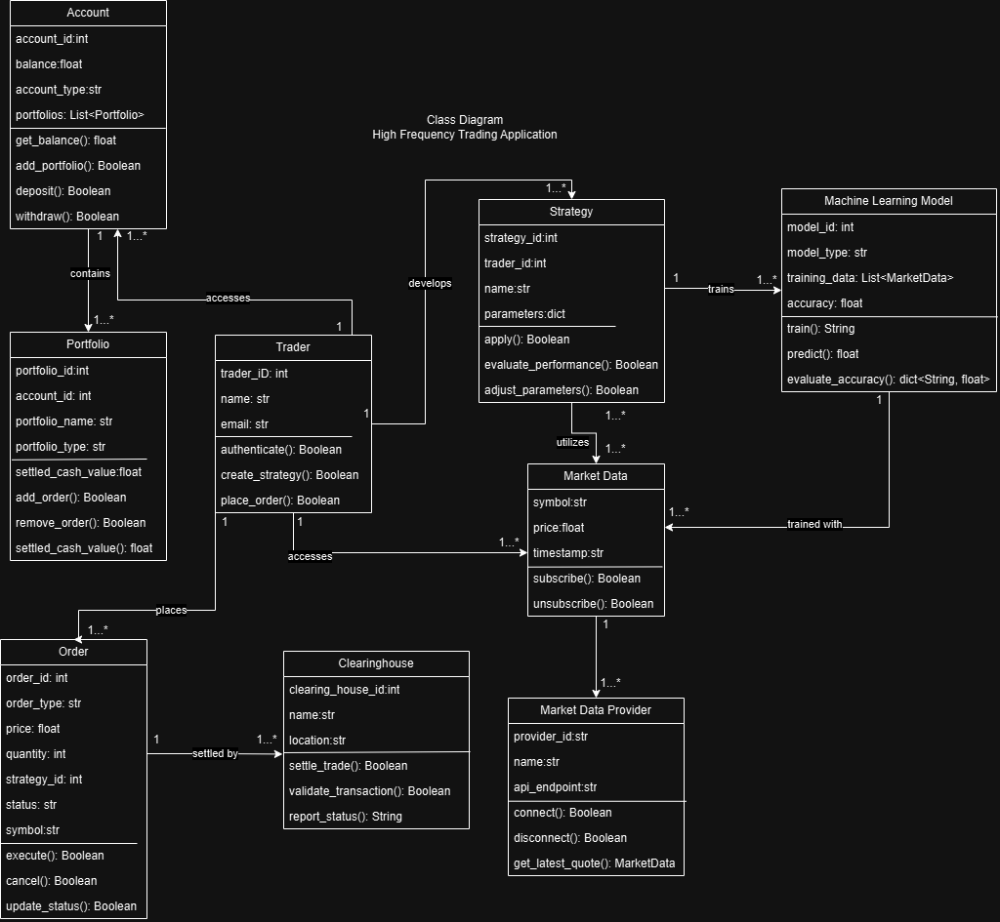

## State Chart Diagram
The State Chart Diagram explains the state transitions of critical objects, such as an Order. An Order might transition through states like "Pending," "Executed“ and "Cancelled" with specific actions triggered by these transitions, such as notifying the Trader or updating the Portfolio's value.

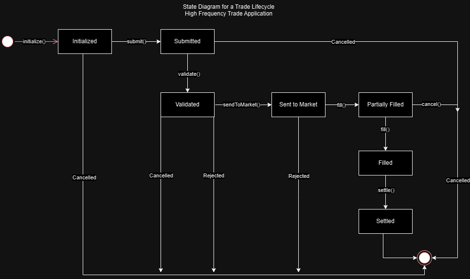

## Component Diagram
The Component Diagram describes the system's modular structure, showing how different component interact and depend on one another. It provides a high-level view of the system's architecture, illustrating how these components are deployed within the overall framework.

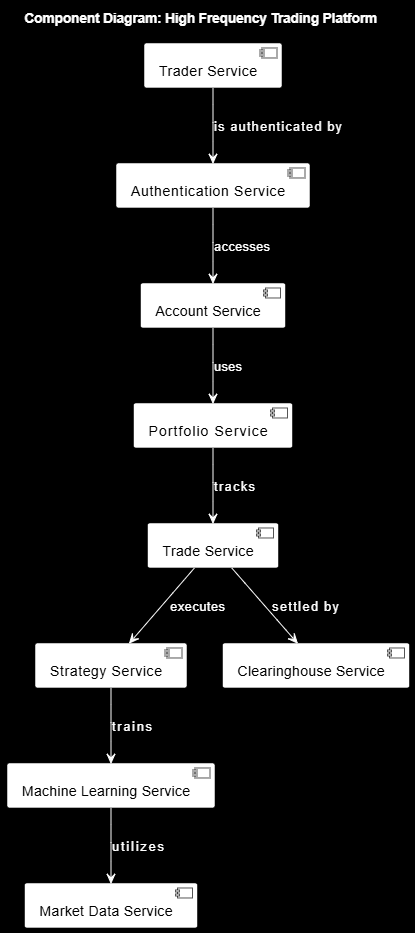

## Deployment Diagram (architecture pattern explanation)
The system adopts a Microservices architecture, where each core function, such as order management, is handled by an independent service. This approach allows for independent development, scaling and deployment of each component, ensuring the system is both scalable and resilient. The choice of Microservices is justified by the need for high availability, flexibility in scaling specific parts of the system and ease of maintenance.

### User Interface & Interaction
- **User/Deployer Access**: Secure trader system access and interaction.
- **Technical Support**: Secured maintenance and monitoring.

### Trading Application Backend
- **Trading Engine**: Core trading logic execution.
- **Market Data Processing**: Real-time market data analysis.
- **Trade Execution**: Secure trade execution system.

### Data Management & Storage
- **Data Storage**: Persistent data storage management.
- **Relational Data**: Secure relational database access.

### Security & Compliance
- **Security Management**: Comprehensive security and protection.
- **Audit & Compliance**: Compliance and audit logging.

### Application Development & Deployment
- **CI/CD**: Automated deployment and integration.
- **API Gateway**: Secure API communication management.

### Monitoring & Logging
- **Logging & Metrics**: Continuous monitoring and logging.
- **Notification Services**: Automated notifications and alerts.

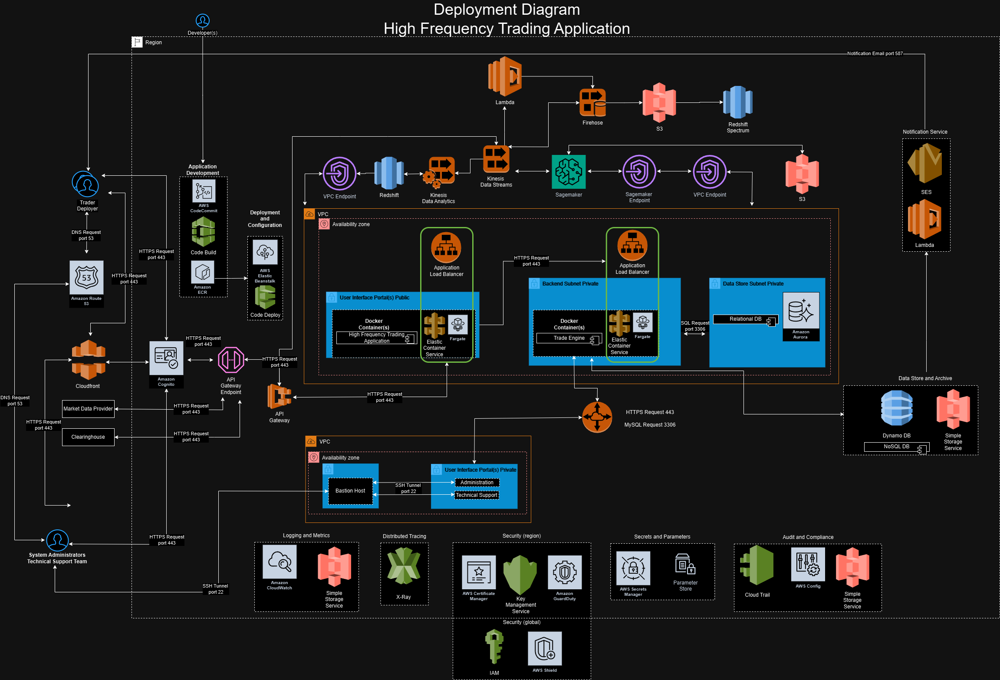
